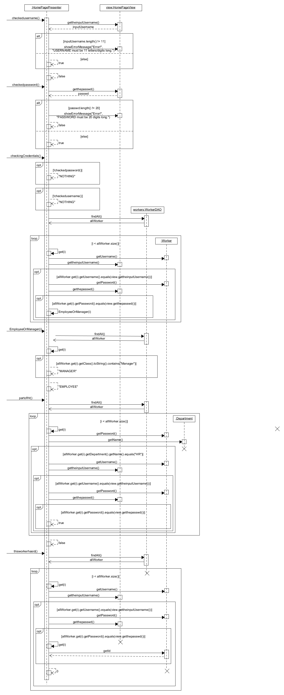
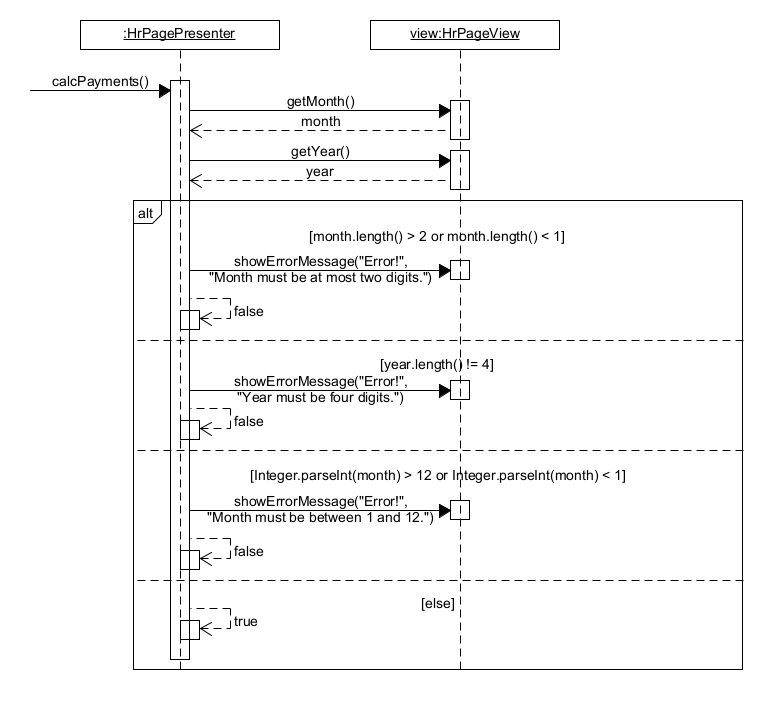

# Staff Management app

## Description

This is a group project, created as part of the course Software Engineering at AUEB (that is the reason a big part of the project is written in greek).

The diagrams were made using the VS Code extension [UMLet](https://marketplace.visualstudio.com/items?itemName=TheUMLetTeam.umlet).

The app was created in 
**Java**, using [Android Studio](https://developer.android.com/studio), and includes **JUnit tests**.
## Project analysis

The end goal was to create an android app that can be used to manage the staff of a company. Each worker can log in with their credentials, and managers specifically can manage the accounts of each employee in their department. That includes creating/editing/deleting their accounts from the system, calculate payments, and manage leave requests placed by the employees.

The project was done in parts (originally uploaded on a private gitlab repository created for us for the purpose of this project).

Each part was meant to emulate a different part of the creation of such a project, as this would have been potentially created in a real setting. This includes the design process, with all the needed diagrams and descriptions, the code, the application itself, and all the needed tests with the best possible coverage.

## Project parts

* R1

    [Περιγραφή Απαιτήσεων](/docs/markdown/R1-software-requirements.md)

* R2

    [Περιπτώσεις Χρήσης και συμπληρωματικές προδιαγραφές για τις μη Λειτουργικές Απαιτήσεις](/docs/markdown/R2.md)

    Domain model:
    

* R3

    Class Diagram:

* R4
  
    Class Diagram for DAO:

  
    Class Diagram for AddAgreement:

    Sequence for AddAgreement:

    Class Diagram for AddAgreementType:

    Sequence for AddAgreementType:

    Class Diagram for AddWorker:

    Sequence for AddWorker:

    Class Diagram for EditWorker:

    Sequence for EditWorker:

    Class Diagram for HandleLeaveRequest:

    Sequence for HandleLeaveRequest:

    Class Diagram for HomePage:

    Sequence for HomePage:

    Class Diagram for hrPage:

    Sequence for hrPage:

    Class Diagram for LeaveRequest:

    Sequence for LeaveRequest:

    Class Diagram for SearchWorkerByAfm:

    Sequence for SearchWorkerByAfm:

    Class Diagram for ShowLeaveRequests:

