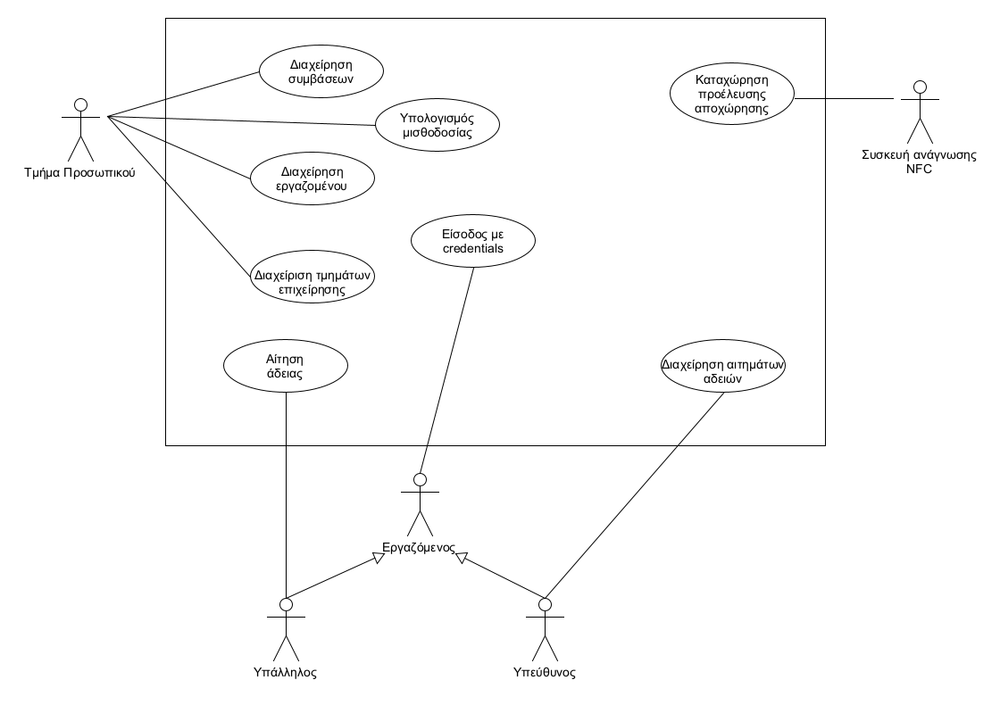

# Περιγραφή Απαιτήσεων

* Το σύστημα θα πρέπει να δέχεται την εισαγωγή των στοιχείων του λογαριασμού του χρήστη και να ελέγχει για την ορθότητα τους.
* Το σύστημα θα πρέπει να δέχεται την εισαγωγή της ώρας προέλευσης και αποχώρησης του εργαζομένου από την εφαρμογή nfc και να τις αντιστοιχεί στον σωστό υπάλληλο.
* Το σύστημα επιτρέπει στον εργαζόμενο ναι αιτηθεί άδεια και τον «υποχρεώνει» να επιλέξει αν πρόκειται για αναρρωτική ή άδεια ανάπαυσης.
* Το σύστημα θα πρέπει να ελέγχει τις υπολειπόμενες μέρες άδειας που δικαιούται ο εργαζόμενος όταν ο ίδιος κάνει αίτηση για άδεια ανάπαυσης.
* Το σύστημα θα πρέπει να προωθεί την αίτηση του υπαλλήλου για άδεια ανάπαυσης αν ο ίδιος έχει υπολειπόμενες μέρες και να εμφανίζει κατάλληλο μήνυμα στον χρήστη.
* Το σύστημα θα πρέπει να απορρίπτει αυτόματα και να εμφανίζει αντίστοιχο μήνυμα στον χρήστη αν αιτείται άδεια ανάπαυσης αλλά δεν έχει υπολειπόμενες μέρες.
* Το σύστημα θα πρέπει να προωθεί το αίτημα του χρήστη για αναρρωτική άδεια στον υπεύθυνο και να εμφανίζει κατάλληλο μήνυμα.
* Το σύστημα θα πρέπει να ενημερώνει τον χρήστη για την εξέλιξη του αιτήματος του σχετικά με την άδεια που έχει αιτηθεί μέσω mail/sms όταν αλλάζει η κατάσταση του.
* Το σύστημα θα πρέπει να επιτρέπει στον εργοδότη να ορίζει τους υπευθύνους.
* Το σύστημα θα πρέπει να επιτρέπει στο τμήμα προσωπικού να αφαιρεί και να προσθέτει εργαζομένους.
* Το σύστημα θα πρέπει να επιτρέπει στο τμήμα προσωπικού να εισάγει τα δεδομένα των συμβάσεων.
* Το σύστημα θα πρέπει να επιτρέπει στους υπεύθυνους να διαχειρίζονται αιτήματα αδειών.
* Το σύστημα θα πρέπει να ενημερώνει μέσω mail/sms τους υπέυθυνους όταν υπάρχει κάποιο αίτημα άδειας.
* Το σύστημα θα επιτρέπει στο τμήμα προσωπικού να διαχειρίζεται τα τμήματα της επιχείρησης. 
* Το σύστημα θα επιτρέπει στο τμήμα προσωπικού να υπολογίζει τη μισθοδοσία. 
